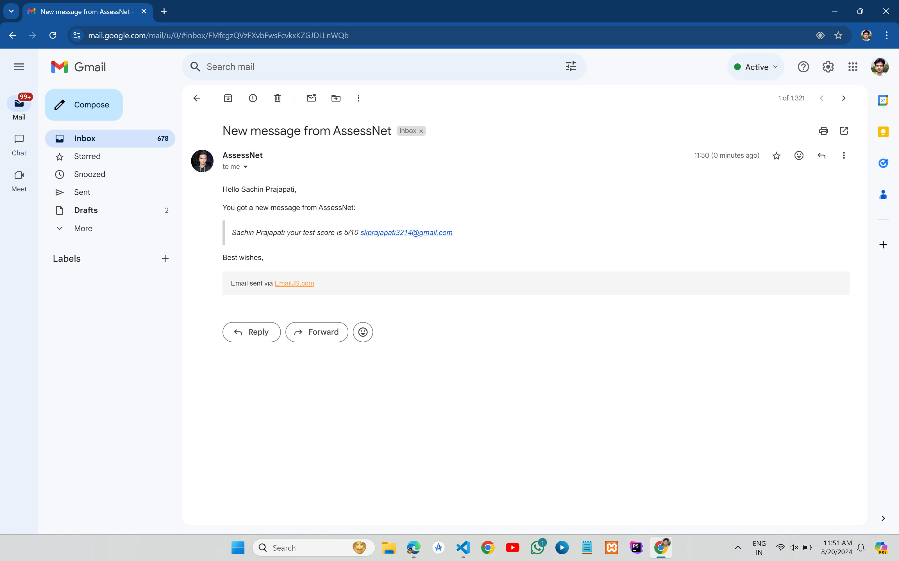
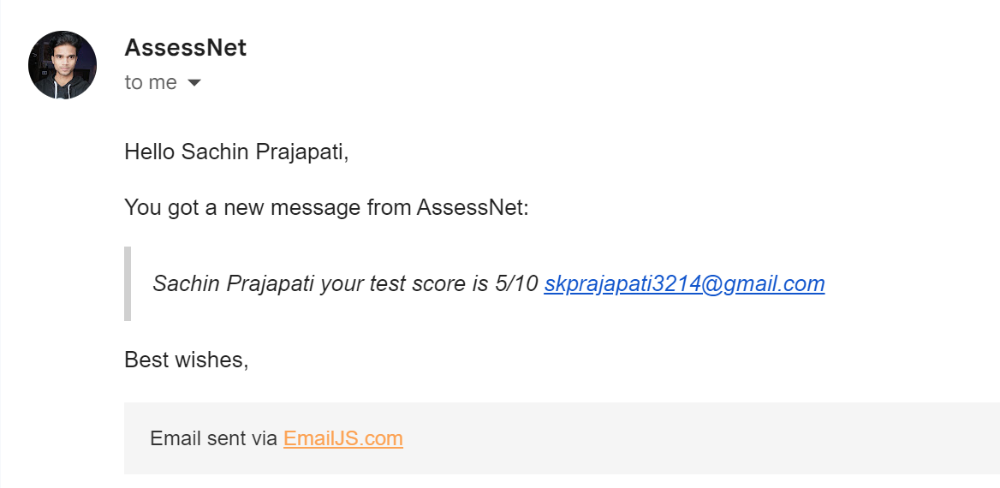

# AssessNet - Test Environment Platform

This project is a comprehensive quiz platform with environment testing capabilities. It includes features such as camera and microphone access testing, user authentication, and email score reporting. The platform is built with a robust backend for authentication and a modern frontend for user interaction.

## Features

- **Environment Testing:** Ensures the user's camera and microphone are working before starting the quiz.
- **User Authentication:** Secure user registration and login using JWTs.
- **Dynamic Quiz:** Presents 10 questions for demo purposes, with a user-friendly interface.
- **Email Score Reporting:** After the quiz, the user's score is automatically sent to their email using EmailJS.

### EmailJS Code Snippet

```js
      const finistTest = () => {

        console.log(user.email)
        console.log(score)
        let emailTemplate = `${user.name} your test score is ${score}/${questions.length}`;
        emailjs.send(
            config.emailJSServiceID,
            config.emailJSTemplateID,
            {
                from_name: 'AssessNet',
                to_name: user.name,
                from_email: 'skprajapati3214@gmail.com',
                to_email: user.email,
                message: emailTemplate
            },
            config.emailJSPublicKEY
        )
            .then((response) => {
                console.log('Email sent successfully');
                console.log(response)
                alert('Email sent successfully');
                dispatch(logout());
                navigate('/');
            })
            .catch((err) => {
                console.error('Error sending email:', err);
                alert('Error sending email');
            });

    }
```    



## Tech Stack

- **Frontend:**
  - React.js with Vite for a fast development experience.
  - Tailwind CSS for styling.
  - EmailJS for sending quiz scores via email.
  
- **Backend:**
  - Node.js and Express.js for handling authentication and other API endpoints.
  - MongoDB for user data management.

- **Environment Management:**
  - .env files for storing sensitive information like API keys and database credentials.

## Project Structure

The project is divided into two main directories:

- **backend:** Contains all the server-side logic.
  - `controllers/`: Business logic for handling user requests.
  - `db/`: Database connection and models.
  - `middleware/`: Authentication and other middleware functions.
  - `routes/`: API endpoints.
  - `lib/`: Utility functions and reusable code.

- **frontend:** Contains all the client-side logic.
  - `src/components/`: React components for different parts of the UI.
  - `src/services/`: Service files for handling API requests and authentication.
  - `src/store/`: State management using Redux.
  - `src/config/`: Configuration files for different environments.

## Getting Started

### Prerequisites

- Node.js and npm installed.
- MongoDB database set up.
- EmailJS account for email integration.

### Installation

1. **Clone the repository:**
   ```bash
   git clone https://github.com/skp3214/AssessNet.git
   cd quiz-platform
   ```

2. **Install dependencies:**
   ```bash
   # Backend
   cd backend
   npm install

   # Frontend
   cd frontend
   npm install
   ```

3. **Environment Variables:**
   Create a `.env` file in both the `backend` and `frontend` directories with the necessary environment variables. Example:

   
   #### Backend .env
        MONGO_URI=
        PORT=5000
        JWT_SECRET=skp3214
        NODE_ENV=development
  
   
   #### Frontend .env
        VITE_APIURL=http://localhost:5000/api/auth
        VITE_APP_EMAILJS_SERVICE_ID=
        VITE_APP_EMAILJS_TEMPLATE_ID=
        VITE_APP_EMAILJS_PUBLIC_KEY=


### Running the Application

1. **Start the backend server:**
   ```bash
   cd backend
   npm run dev
   ```

2. **Start the frontend server:**
   ```bash
   cd frontend
   npm run dev
   ```

3. **Access the application:**
   Open your browser and navigate to `http://localhost:5173`.

## Usage

- **Sign Up/Login:** Users must sign up or log in to access the quiz.
- **Environment Test:** Before starting the quiz, users are required to allow access to their camera and microphone.
- **Take Quiz:** Answer the 10 demo questions presented.
- **Score Reporting:** After submitting the quiz, the user's score is sent to their registered email.

